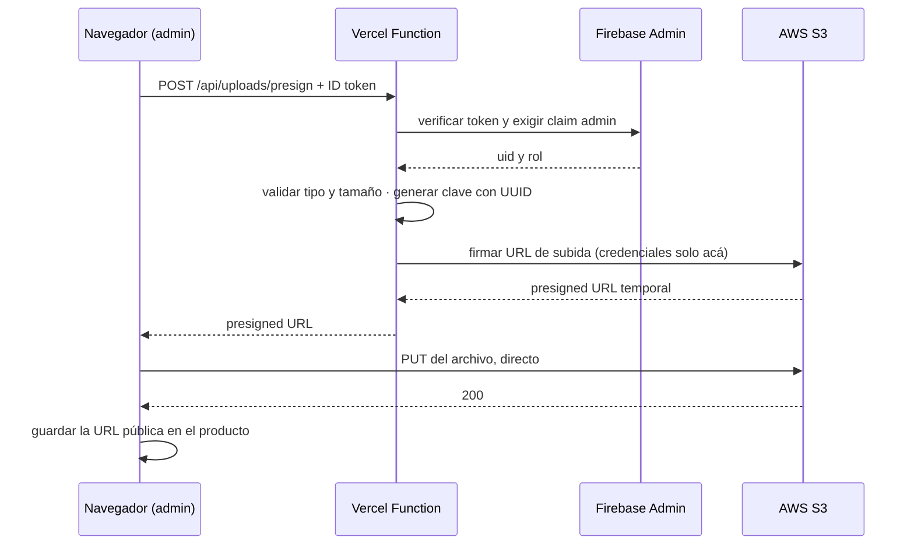

# CLACK

Tienda curada de periféricos de computadora. Aplicación de página única con dos roles: el cliente
que navega el catálogo y compra, y el administrador que gestiona productos y órdenes desde un panel
protegido.

**Estado: en producción.** Las 14 slices del plan original y sus 3 extras (paginación, reseñas,
dashboard de analytics) están construidas, mergeadas y en vivo. El release 1 cerró el
[Cierre](https://github.com/HRamiroAlbornoz/e-commerce-platform/pull/29) el 22/09/2026.

---

## Contexto del cliente

Patagonix Tech, una software factory del sector retail, recibe el pedido de una plataforma de
e-commerce para un cliente que vende periféricos. El pedido explícito es una solución escalable y
mantenible basada en servicios administrados, para reducir costos de infraestructura y acelerar la
salida a producción.

De ahí sale el stack: Firebase para autenticación y datos, AWS S3 para imágenes, Vercel para el
deploy y las funciones serverless. Nada de servidores propios que mantener.

**Posicionamiento:** CLACK no es un catálogo infinito. Entre 24 y 40 productos elegidos, cada uno
con una opinión escrita sobre para quién es y para quién no. Esa es la diferencia que una tienda de
2000 productos no puede copiar, y es lo que explica las decisiones de diseño.

---

## Stack

| Capa | Tecnología |
|---|---|
| Frontend | React 19, TypeScript estricto, Vite |
| Rutas | React Router 7 (importado de `react-router`) |
| Estilos | Tailwind CSS v4, configuración CSS-first (sin `tailwind.config.js`) |
| Estado global | Context API + useReducer, en dos contextos separados |
| Autenticación | Firebase Authentication |
| Base de datos | Firebase Firestore |
| Imágenes | AWS S3 con presigned URLs |
| Serverless | Vercel Functions |
| Validación | Zod, con los tipos derivados por `z.infer` |
| Testing | Vitest, React Testing Library, `@firebase/rules-unit-testing` |
| Deploy | Vercel, con integración continua desde GitHub |

---

## Documentación

| Documento | Qué contiene |
|---|---|
| [`docs/spec.md`](docs/spec.md) | Alcance, qué queda afuera, decisiones de infraestructura, criterios de aceptación y los flujos reales del recorrido |
| [`docs/arquitectura.md`](docs/arquitectura.md) | Modelo de dominio: entidades, campos, relaciones y las trece reglas del negocio, con diagramas |
| [`docs/adr/`](docs/adr/) | Ocho decisiones caras de revertir, una por archivo |
| [`docs/pendientes.md`](docs/pendientes.md) | Deuda técnica clasificada en el Cierre |
| `PRODUCT.md` / `DESIGN.md` | Verdad de producto durable y sistema visual global, gestionados por Impeccable |
| `.impeccable/surfaces/` | Un brief de diseño por superficie, con su contrato de dirección |
| `CLAUDE.md` | Bitácora completa de cada slice: decisiones, hallazgos y cómo se verificaron |

---

## Decisiones de arquitectura

El detalle, con las alternativas descartadas y las consecuencias, está en
[`docs/adr/`](docs/adr/). El resumen:

**[0001] El rol vive en Firestore y se espeja a un custom claim.** Cada `get()` dentro de una
security rule se factura como lectura; un custom claim se lee del token sin costo. El rol se asigna
con un script de operador, no con un endpoint HTTP, porque un endpoint que otorga privilegios es
una vía de escalación.

**[0002] Context API + useReducer para el estado global.** Es una restricción del enunciado, no una
elección: en 2026 el default serían Zustand y TanStack Query. Se registra para que no se lea como
desconocimiento, y la estructura aísla el acceso a datos para que ese techo se pueda levantar sin
reescribir la aplicación.

**[0003] Imágenes en S3 con presigned URLs.** El frontend nunca ve una credencial de AWS: pide una
URL firmada a una Vercel Function que verifica el ID token de Firebase y exige el claim de
administrador, y después sube el archivo directo a S3. La autenticación de esa función no la pide
el enunciado; sin ella, cualquiera sube archivos al bucket.

**[0004] El carrito admite invitados y se fusiona al iniciar sesión.** Un producto en los dos
carritos queda con la cantidad mayor, no con la suma.

**[0005] Borrar un producto tiene dos niveles.** "Retirar del catálogo" es reversible y es la acción
normal. "Eliminar definitivamente" solo está disponible si el producto no tiene ventas ni reseñas,
porque Firestore no borra subcolecciones al borrar el documento padre.

**[0006] El promedio de reseñas lo calcula el servidor.** Si la regla le permite a un cliente
escribir el promedio, puede escribir cualquier número, y ninguna regla puede verificarlo sin leer
todas las reseñas. Lo recalcula una Vercel Function con el Admin SDK.

**[0007] La orden se crea desde una Vercel Function con el Admin SDK, no con una transacción del
cliente.** Validar stock, precio y crear la orden a la vez es un invariante entre varios documentos:
frágil en security rules, e inseguro si el total lo manda el cliente. La función lee el carrito real
del servidor, nunca lo que declara la request, y usa un id pre-generado para que un reintento no
descuente stock dos veces.

**[0008] Crear y editar productos también pasa por una Vercel Function.** A diferencia de las
órdenes, acá el problema no es un invariante cruzado sino la riqueza de un solo documento: `specs`
es un array de 1 a 12 objetos, y las security rules no iteran arrays de objetos sin reglas frágiles
repetidas a mano.

---

## Estructura

```
api/                  Vercel Functions. Cada archivo es un endpoint
  _lib/                 código compartido; el guion bajo lo excluye del enrutamiento
shared/schemas/       el contrato Zod. Lo importan src/ y api/ por igual
scripts/              seed del catálogo (emulador y producción) y asignación del rol admin
src/
  components/ui/        primitivos con accesibilidad incorporada una sola vez
  components/states/    LoadingState, EmptyState, ErrorState, Skeleton
  contexts/             AuthContext, CartContext y el cartReducer puro
  features/             auth, products, cart, checkout, orders, reviews, admin, analytics
  hooks/                hooks genéricos compartidos entre features (useKeyedAsync, etc.)
  layouts/              un marco por superficie: pública, privada, administración
  lib/                  firebase con sus converters, errores, dinero, validación de env
  routes/               un archivo de rutas por superficie, más los dos guards
  test/                 setup y el wrapper de providers reutilizable
tests/rules/          tests de security rules contra el emulador
docs/                 spec, arquitectura, ADRs, referencias de diseño
```

Tres decisiones de esta estructura que no son obvias:

- **`shared/schemas/` vive fuera de `src/`** para que las funciones serverless no tengan que
  importar desde dentro del frontend. Es un contrato compartido sin el costo de un monorepo.
- **`features/products/` contiene el catálogo público y el CRUD del administrador.** Comparten
  esquema, converter y servicio de datos; separarlos duplicaría el acceso a Firestore.
- **Las rutas están partidas por superficie.** `router.tsx` solo compone, así que es el único
  archivo que no crece con el proyecto.

---

## Instalación y configuración

Requiere Node 24.x y Java (el Firebase Emulator Suite corre sobre la JVM).

```bash
npm install
cp .env.example .env
```

Completar `.env` con la config de un proyecto de Firebase propio (Auth + Firestore) y, si se va a
probar la subida de imágenes, un bucket de S3 con las credenciales de un usuario IAM acotado a
`PutObject` sobre el prefijo de productos. Las variables `FIRESTORE_EMULATOR_HOST` y
`FIREBASE_AUTH_EMULATOR_HOST` de `.env.example` ya apuntan al emulador local; dejarlas así para
desarrollo.

**Frontend + emulador** (alcanza para trabajar sobre `src/`, sin tocar `api/`):

```bash
firebase emulators:start   # Firestore :8080, Auth :9099, UI :4000
npm run seed                # carga el catálogo de 18 productos en el emulador
npm run dev                 # Vite en :5173
```

**Para tocar también las Vercel Functions** (`api/`), hace falta un segundo proceso — `vercel dev`
no puede servir el frontend de este proyecto directamente (ver la nota en `CLAUDE.md`, slice 7b):

```bash
vercel dev --listen 3000   # solo sirve /api/*; vite.config.ts ya proxea /api hacia acá
npm run dev                 # en otra terminal, el frontend real
```

`npm run grant-admin -- <email>` promueve una cuenta ya registrada a `admin` (rol en Firestore +
custom claim). `npm test` corre la suite de componentes/unitarios; `npm run test:functions` y
`npm run test:rules` corren contra el emulador real (`firebase emulators:exec`).

## Flujo de subida de imágenes a S3



Las credenciales de AWS existen únicamente en el entorno de la función. Nunca llegan al navegador,
y al no llevar el prefijo `VITE_`, Vite no las puede incluir en el bundle ni por accidente.

---

## URL de producción

**[clack-liart.vercel.app](https://clack-liart.vercel.app)** — pública, sin login (`/api/health`
responde `{ ok: true }`). Deploy continuo desde GitHub: cada merge a `main` despliega a producción;
cada rama tiene su propio preview.

---

## Bitácora de uso de IA

Se lleva **durante** el desarrollo, no al final. Cada entrada registra una pregunta real, qué
cambió la respuesta, y qué se decidió.

### 1 · ¿Dónde vive el rol del usuario?

**La pregunta:** la guía del proyecto dice guardar el rol en Firestore y leerlo al iniciar sesión.
¿Es esa la mejor opción, o hay algo que la guía no menciona?

**Qué cambió la respuesta:** la consulta a la documentación de Firebase trajo un dato que la guía no
menciona y que decide la cuestión: **cada `get()` o `exists()` dentro de una security rule se
factura como una lectura**. Con la propuesta de la guía, cada operación del panel de administración
paga una lectura extra solo para preguntar "¿este usuario es admin?".

**Decisión:** custom claims espejados desde Firestore, y el rol se asigna con un script de operador
en vez de un endpoint. Ver [ADR 0001](docs/adr/0001-roles-con-custom-claims-espejados-desde-firestore.md).

### 2 · No se puede elegir un diseño leyendo párrafos

**La pregunta:** pedí tres direcciones visuales y las recibí como texto, paleta y descripción. Pedí
otra ronda. Y otra.

**Qué cambió la respuesta:** al segundo re-roll quedó claro que el problema no eran las direcciones
sino el formato: **una dirección visual no se juzga leyendo**. La salida fue construir maquetas HTML
estáticas y descartables de la portada y mirarlas renderizadas en el navegador.

**Decisión:** la dirección se eligió mirando tres maquetas reales, no leyendo tres descripciones. Y
la elegida fue una mezcla de dos, algo que era imposible de ver sin tenerlas en pantalla. Lección
transferible: cuando una decisión es visual, el entregable de la conversación tiene que ser visual.

### 3 · Leer dos secciones de la spec juntas encontró dos contradicciones

**La pregunta:** ¿la especificación es internamente consistente?

**Qué cambió la respuesta:** leer la sección de infraestructura contra la de criterios de aceptación
sacó a la luz dos choques que por separado eran invisibles. Primero: **Firestore no tiene búsqueda
de texto completo**, así que buscar por nombre solo funciona por prefijo, y si la búsqueda se
hiciera del lado del cliente, la paginación se caía. Segundo: **Firestore no puede sumar campos
dentro de los objetos de un array**, y las cantidades vendidas viven dentro de los ítems de cada
orden, así que "productos más vendidos" no era consultable.

**Decisión:** dos caminos de consulta que ambos paginan, con la limitación del prefijo declarada en
la interfaz; y un contador `unitsSold` en el producto, que se mantiene gratis en la transacción de
compra que ya escribe ese documento.

### 4 · Dos contadores parecidos que se comportan distinto

**La pregunta:** si cancelar una orden devuelve el stock, ¿también tiene que revertir los
contadores?

**Qué cambió la respuesta:** la pregunta forzó a separar dos cosas que parecían una.
`unitsSold` es una métrica de ventas, así que una venta cancelada no cuenta y tiene que bajar.
`orderCount` responde "¿este producto tuvo alguna vez una orden?" para la guarda del borrado
definitivo, y una orden cancelada sigue existiendo, así que **no** tiene que bajar.

**Decisión:** la asimetría se documentó **con su motivo** y no solo como regla, porque es
exactamente el tipo de inconsistencia aparente que alguien "arregla" seis meses después, rompiendo
la guarda del borrado.

### 5 · Una regla propia que había que revisar, no obedecer

**La pregunta:** mi configuración exige un logger estructurado tipo pino y prohíbe `console.log` en
producción. ¿Aplica igual en funciones serverless?

**Qué cambió la respuesta:** en una Vercel Function, pino agrega peso de bundle y tiempo de arranque
en frío sin aportar lo que lo hace valioso —transporte, rotación, destinos múltiples—, porque Vercel
ya captura y agrupa la salida estándar. Pero lo que la regla realmente combate no es la librería
ausente, es el `console.log` suelto con un mensaje vago.

**Decisión:** JSON estructurado a mano con `timestamp`, `level`, `requestId`, `code` y `message`, y
la regla reescrita **con su condición explícita**: el día que el proyecto tenga un backend de larga
vida, entra pino. No es una excepción suelta, es una regla condicionada.

### 6 · Seguridad que el enunciado no pide

**La pregunta:** el enunciado describe el flujo de presigned URLs como una forma de no exponer las
credenciales de AWS. ¿Alcanza con eso?

**Qué cambió la respuesta:** no alcanza. El enunciado resuelve que las credenciales no lleguen al
navegador, pero no dice nada sobre **quién puede pedir una URL firmada**. Sin autenticar la función,
el endpoint firma URLs de subida para cualquiera que lo llame, y el bucket se convierte en
almacenamiento gratuito para desconocidos.

**Decisión:** la función verifica el ID token de Firebase con el Admin SDK, exige el claim de
administrador, valida tipo y tamaño del archivo, y genera la clave con un UUID. La misma revisión
sumó la regla de que un usuario no pueda escribirse `role: 'admin'` en su propio documento.
