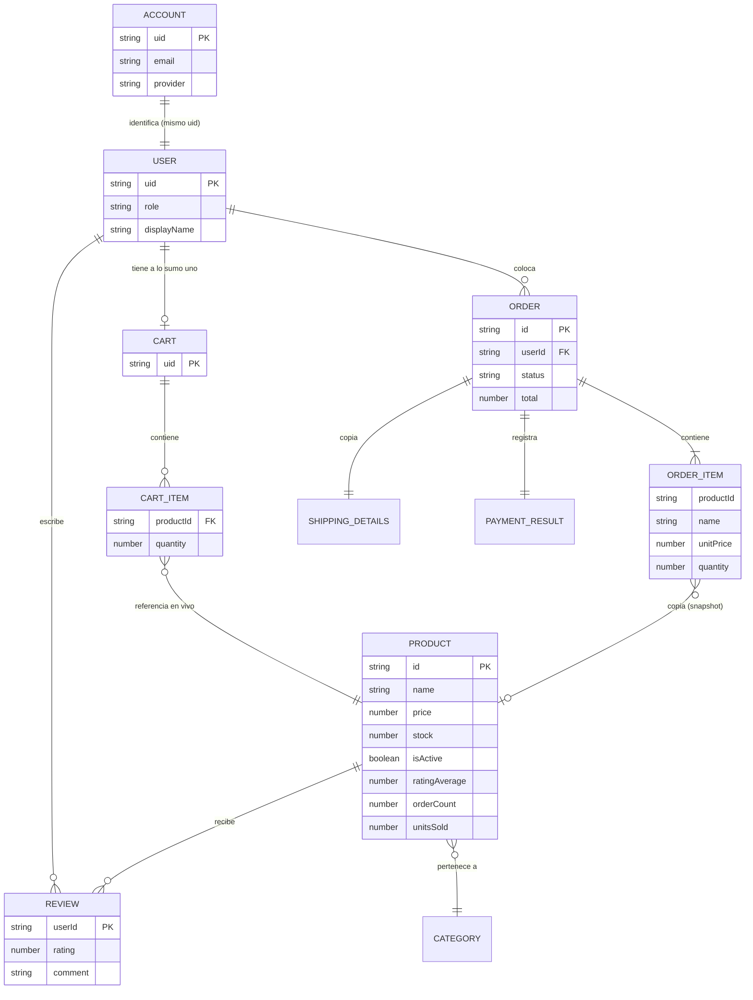
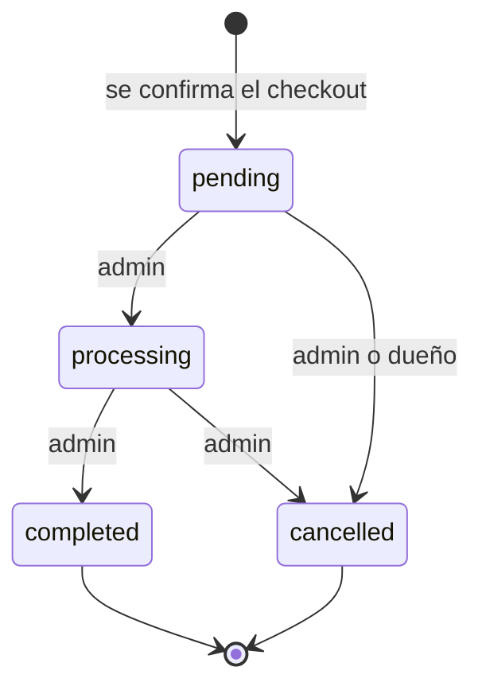

# Modelo de dominio

Vocabulario y entidades del e-commerce. Este documento define **qué significa cada palabra** en
este proyecto y **qué forma tienen los datos**. No define cómo se ven las pantallas (eso es
`DESIGN.md`) ni qué tiene que hacer la aplicación (eso es `docs/spec.md`).

Cuando una palabra de este glosario aparece en el código, se escribe en inglés y exactamente con
este significado. Si hace falta un concepto nuevo, primero se agrega acá.

---

## Lenguaje

### Personas y acceso

**Account**
La identidad que administra Firebase Authentication: credenciales, proveedor de login y `uid`.
No es nuestra; no la modelamos, la consumimos.
_Evitar_: usuario de Firebase, login.

**User**
El perfil que sí es nuestro, con nombre, rol y fechas. Existe uno por Account y comparte su `uid`.
_Evitar_: profile, cuenta, miembro.

**Role**
Lo que un User puede hacer: `customer` o `admin`. Es un atributo del User, no una entidad, y no
existe un tercer rol.
_Evitar_: permiso, tipo de usuario.

**Customer**
Un User con rol `customer`. Navega, compra y reseña.
_Evitar_: cliente final, comprador, client.

**Administrator**
Un User con rol `admin`. Gestiona el catálogo y las órdenes. No compra desde el panel.
_Evitar_: admin user, staff, moderador.

### Catálogo

**Product**
Un artículo del catálogo, con precio, stock, imagen y categoría.
_Evitar_: item, artículo, SKU.

**Category**
El grupo al que pertenece un Product, tomado de un conjunto cerrado y conocido de antemano. Es un
valor, no una entidad: no se crea ni se administra.
_Evitar_: rubro, colección, tag.

**Active product**
Un Product visible en el catálogo. Lo contrario es un Product inactivo: sigue existiendo y sus
órdenes y reseñas siguen siendo válidas, pero no se lista ni se puede comprar.
_Evitar_: producto borrado, producto eliminado.

**Retire**
Sacar un Product del catálogo poniendo `isActive` en `false`. Es la acción habitual del
Administrator, es reversible y no destruye nada.
_Evitar_: eliminar, borrar, dar de baja.

**Hard delete**
Borrar el documento de un Product de verdad. Solo es posible mientras nada lo referencie: ninguna
Order y ninguna Review. Es irreversible.
_Evitar_: eliminar (a secas), purgar.

**Stock**
Las unidades disponibles de un Product. Baja al confirmarse una Order y vuelve a subir si esa
Order se cancela.
_Evitar_: inventario, existencias, cantidad.

**Oversell**
Vender más unidades de las que hay, por dos compras simultáneas de las últimas existencias. Es la
condición que la transacción del checkout tiene que impedir.
_Evitar_: sobreventa, race condition de stock.

### Compra

**Cart**
El conjunto de productos que un Customer piensa comprar. Hay exactamente uno por User y no tiene
historial: al confirmarse la compra se vacía, y lo que queda como registro es la Order.
_Evitar_: carrito de compras, basket, bag.

**Guest cart**
El Cart de un visitante sin sesión. Vive en el navegador y no existe en la base de datos. Al
iniciar sesión se fusiona con el Cart del User.
_Evitar_: carrito anónimo, carrito temporal.

**CartItem**
Una línea del Cart: **referencia** a un Product más una cantidad. No guarda el precio, porque el
Cart siempre muestra el precio de hoy.
_Evitar_: línea de carrito, producto del carrito.

**Order**
El registro inmutable de una compra confirmada. Guarda una **copia** de lo comprado, no
referencias, y por eso un cambio posterior en el catálogo no la altera.
_Evitar_: compra, pedido, transacción, purchase.

**OrderItem**
Una línea de la Order: nombre, precio unitario, imagen y cantidad **copiados** del Product en el
momento de la compra. No tiene identidad propia ni se consulta por separado.
_Evitar_: línea de pedido, detalle de orden.

**Snapshot**
La copia de datos de otra entidad tomada en un instante y congelada a propósito. Es el mecanismo
que hace inmutable a la Order.
_Evitar_: cache, denormalización, copia.

**Order status**
El punto del ciclo de vida en que está una Order: `pending`, `processing`, `completed` o
`cancelled`. Solo un Administrator lo cambia.
_Evitar_: estado del pedido, etapa.

**ShippingDetails**
A dónde y a nombre de quién va la Order. Se completa en el checkout y se copia dentro de la Order.
No es una entidad reutilizable: este proyecto no tiene libreta de direcciones.
_Evitar_: Address, dirección de envío como entidad.

**Simulated payment**
El paso de pago del checkout, que no contacta ninguna pasarela y siempre puede forzarse a éxito o
a error para probar el flujo. Nunca recibe ni guarda datos reales de tarjeta.
_Evitar_: pago, checkout de pago, pasarela.

### Opinión

**Review**
La calificación y el comentario de un User sobre un Product. Hay como máximo una por User y por
Product; volver a opinar reemplaza la anterior.
_Evitar_: reseña, comentario, rating, valoración.

**Rating**
El número de 1 a 5 de una Review. El promedio de un Product se llama `ratingAverage` y la cantidad
de reseñas `ratingCount`.
_Evitar_: estrellas, puntaje, score.

---

## Entidades y valores

Separar estas dos cosas es la decisión que más ordena el modelo.

Una **entidad** tiene identidad propia y vida independiente: se crea, se busca por su id, se
modifica y sigue siendo la misma cosa. Un **valor** no: existe solamente dentro de algo más, no se
consulta por separado y no tiene sentido fuera de su contenedor.

| Entidad | Identidad | Por qué es entidad |
|---|---|---|
| `User` | `uid` del Account | Se consulta por sí misma y sobrevive a todo lo demás |
| `Product` | id generado | Se lista, se filtra, se edita y se referencia desde otras partes |
| `Cart` | `uid` de su dueño | Tiene estado que cambia en el tiempo, aunque siempre pertenezca a un solo User |
| `Order` | id generado | Es el registro permanente del negocio |
| `Review` | `uid` del autor, dentro del Product | Se edita y se borra por separado del Product |

| Valor | Vive dentro de | Por qué **no** es entidad |
|---|---|---|
| `Category` | `Product` | Conjunto cerrado y conocido. Nadie crea categorías |
| `CartItem` | `Cart` | No existe un CartItem sin su Cart, ni se busca uno suelto |
| `OrderItem` | `Order` | Nace y muere con su Order, y nunca se consulta aparte |
| `ShippingDetails` | `Order` | Sin libreta de direcciones, no hay nada que reutilizar |
| `PaymentResult` | `Order` | Es el resultado de un paso del checkout, no una cosa del negocio |

### Campos

**User**

| Campo | Tipo | Nota |
|---|---|---|
| `uid` | string | Igual al del Account. Es la identidad, no se genera aparte |
| `email` | string | Copiado del Account al registrarse |
| `displayName` | string | Editable por el propio User |
| `role` | `'customer' \| 'admin'` | Fuente de verdad del rol. Se espeja a un custom claim del token |
| `createdAt` | timestamp | Del servidor, nunca del reloj del cliente |

**Product**

| Campo | Tipo | Nota |
|---|---|---|
| `id` | string | Generado |
| `name` | string | Con límite de longitud |
| `nameLower` | string | `name` en minúsculas y sin acentos. Existe solo para la búsqueda: Firestore no tiene búsqueda de texto completo, así que buscar por nombre es una consulta de rango sobre este campo, y por eso coincide **por prefijo** |
| `description` | string | Con límite de longitud |
| `price` | number | En la moneda única del proyecto. Se redondea explícitamente al calcular |
| `stock` | number | Entero, nunca negativo |
| `category` | `Category` | Del conjunto cerrado |
| `displayColor` | `DisplayColor` | Del conjunto cerrado (`lime`, `magenta`, `cyan`, `amber`). Es el campo de color de la cartela del catálogo, **no** el color físico de la pieza: existe para que un catálogo de periféricos mayormente negros se pueda recorrer de un vistazo |
| `imageUrl` | string | Apunta al objeto en S3 |
| `isActive` | boolean | `false` es un producto retirado del catálogo |
| `ratingAverage` | number | Derivado de las Reviews. **Solo lo escribe el servidor** |
| `ratingCount` | number | Derivado de las Reviews. **Solo lo escribe el servidor** |
| `orderCount` | number | Cuántas Orders incluyeron este Product alguna vez. Habilita la pregunta "¿se puede hacer hard delete?" sin ninguna consulta extra. **No baja nunca**, ni al cancelar |
| `unitsSold` | number | Unidades efectivamente vendidas. Alimenta el ranking de más vendidos del dashboard. **Sí baja** al cancelar una Order |
| `createdAt` / `updatedAt` | timestamp | Del servidor |

**Cart** — un solo documento por User, identificado por su `uid`.

| Campo | Tipo | Nota |
|---|---|---|
| `items` | `CartItem[]` | `{ productId, quantity }`. Sin precio: se resuelve contra el catálogo |
| `updatedAt` | timestamp | Del servidor. Sirve para resolver el merge del Guest cart |

**Order**

| Campo | Tipo | Nota |
|---|---|---|
| `id` | string | Generado |
| `userId` | string | `uid` del comprador. Es el campo por el que se filtra el historial |
| `items` | `OrderItem[]` | `{ productId, name, unitPrice, imageUrl, quantity }`, todo copiado |
| `subtotal` / `shippingCost` / `total` | number | Calculados y guardados, no recalculados al leer |
| `status` | `OrderStatus` | Arranca en `pending` |
| `shipping` | `ShippingDetails` | Copiado del checkout |
| `payment` | `PaymentResult` | Método y resultado simulado. **Sin ningún dato de tarjeta** |
| `createdAt` / `updatedAt` | timestamp | Del servidor |

**Review** — identificada por el `uid` de su autor, dentro del Product.

| Campo | Tipo | Nota |
|---|---|---|
| `userId` | string | Es también el id del documento. Hace imposible tener dos del mismo autor |
| `displayName` | string | Copiado para no leer el User al mostrar la lista |
| `rating` | 1 a 5 | Entero |
| `comment` | string | Con límite de longitud |
| `createdAt` / `updatedAt` | timestamp | Del servidor |

---

## Relaciones

Las dos flechas hacia `PRODUCT` dicen cosas distintas, y es el punto más importante del diagrama:

- `CART_ITEM → PRODUCT` es una **referencia en vivo**. El carrito muestra el nombre y el precio que
  el producto tiene ahora. Si el precio sube hoy, el carrito sube hoy.
- `ORDER_ITEM → PRODUCT` es una **copia**. La línea de la orden ya tiene el nombre y el precio
  adentro.

La relación de la copia es opcional (`o|`) a propósito, y no es un descuido: la regla del hard
delete (`orderCount === 0`) hace que un producto con ventas no se pueda borrar, así que en la
práctica el producto siempre existe, retirado o activo. La flecha es opcional porque la Order **no
depende** de que exista: si mañana alguien borra un documento a mano desde la consola de Firebase,
el historial de compras se sigue leyendo entero. Un modelo que se rompe cuando falta un dato que
no necesitaba es un modelo mal dibujado.

---

## Reglas del dominio

Cada una se traduce después en un criterio de aceptación, un test o una security rule.

**1. Una Order es inmutable salvo su estado.** Los ítems, los totales y los datos de envío no se
modifican nunca después de crearla. Lo único que cambia es `status`.

**2. Las transiciones de estado son dirigidas y tienen estados terminales.**

`completed` y `cancelled` son finales: de ahí no se sale. Una Order `completed` que vuelve a
`pending` no significa nada en el negocio, así que no se permite.

**3. Quién cambia el estado depende del estado.** Un Administrator puede hacer cualquier
transición permitida por el grafo. El dueño de la Order puede hacer **una sola**: cancelarla
mientras esté en `pending`. Ya despachada (`processing`) deja de ser su decisión, y eso es
justamente lo que hace que la regla valga la pena escribirla: el permiso no depende solo de quién
sos, también de en qué estado está la cosa.

**4. Un Customer solo lee sus propias Orders.** Se filtra por `userId`, y la security rule lo
exige del lado del servidor. Filtrar solo en el frontend no protege nada.

**5. Los precios se copian al comprar y se calculan una sola vez.** El `total` guardado es el que
vale. Recalcularlo al leer abriría la puerta a que una orden vieja cambie de monto.

**6. Todo monto se redondea explícitamente** al calcularse (`Math.round(valor * 100) / 100`),
porque en punto flotante `0.1 + 0.2` no es `0.3`.

**7. Una Review por User y por Product.** Se garantiza usando el `uid` como identificador del
documento: no hace falta chequear duplicados, son imposibles de crear.

**8. Nadie se asigna su propio rol.** Al registrarse solo se acepta `customer`, y después el campo
`role` no se puede modificar desde el cliente.

**9. Las fechas las pone el servidor.** El reloj del navegador puede estar mal o alterado a
propósito.

**10. Los datos de tarjeta no se guardan ni se loguean.** El pago es simulado: la Order registra
el método y el resultado, y nada más. Un campo con un número de tarjeta, aunque sea de prueba, no
existe en este modelo.

**11. Crear una Order y descontar el stock son la misma operación.** Corren en una única
transacción de Firestore: se leen los productos del carrito, se verifica que haya stock de todos,
y solo entonces se escriben la Order nueva y los productos con el stock rebajado, el `orderCount`
incrementado en uno y el `unitsSold` incrementado por la cantidad comprada. Si algo falla en el
medio, no queda nada a medio hacer.

Los tres contadores viajan gratis: la transacción ya escribe el documento del producto para bajar
el stock, así que actualizar los otros dos campos no agrega ninguna operación.

El caso que esto existe para impedir: dos personas comprando la última unidad al mismo tiempo. La
transacción vuelve a leer y una de las dos se reintenta o falla; lo que no puede pasar es que las
dos compren. Cuando falla, el mensaje tiene que decir qué producto se quedó sin stock, no "error
al procesar".

**12. Cancelar una Order devuelve el stock y descuenta las unidades vendidas, pero no el
`orderCount`.** En la misma transacción que cambia el estado a `cancelled` se suman de vuelta las
unidades al `stock` y se restan del `unitsSold`. Sin lo primero, cada cancelación evaporaría
inventario para siempre; sin lo segundo, el dashboard contaría como vendido algo que no se vendió.

**`orderCount` no se revierte, y la asimetría es deliberada.** Los dos contadores se parecen pero
responden preguntas distintas: `unitsSold` es una métrica de ventas, así que una venta cancelada no
cuenta; `orderCount` responde "¿este producto tuvo alguna vez una orden?", y una orden cancelada
sigue siendo una orden que existe y que referencia al producto. Bajarlo permitiría borrar
definitivamente un producto del que hay registro histórico. Si alguien más adelante los "unifica"
por consistencia, rompe la guarda del hard delete.

Que `cancelled` sea un estado terminal es lo que evita el otro bug: una Order no se puede cancelar
dos veces, así que el stock no se puede devolver dos veces.

**13. Un Product solo se puede borrar de verdad si nada lo referencia.** El hard delete exige
`orderCount === 0` y `ratingCount === 0`. Si no se cumple, la única acción disponible es retirarlo
del catálogo.

El motivo no es sentimental: Firestore **no borra las subcolecciones** cuando se borra el
documento padre. Un Product borrado con reseñas adentro dejaría esas reseñas existiendo pero
inalcanzables, ocupando lugar y sin forma de llegar a ellas. Exigir cero reseñas hace que el
problema no pueda darse.

---

## Decisiones de modelado y por qué

Seis puntos donde el modelo se aparta de lo que parecería obvio.

**`Category` no es una colección.** Con un conjunto cerrado de categorías de periféricos, un union
type de TypeScript valida en compilación lo que una colección validaría en runtime y con una
lectura extra. El costo es real y aceptado: agregar una categoría requiere cambiar código y
deployar. El enunciado nunca pide administrar categorías.

**`DisplayColor` es un segundo conjunto cerrado, igual que `Category`, y no es el color físico de
la pieza.** El criterio F2.9 de la spec pedía mostrar "el color de la pieza" en la tarjeta, y el
modelo original no lo había capturado — se agregó al revisar el contrato antes de la primera
slice, primero como el color físico del periférico. Al construir la superficie contra el brief de
diseño ya escrito (`.impeccable/surfaces/`), apareció la versión correcta: el campo de color es un
recurso curatorial de la cartela — cuatro colores fijos y con nombre (`lime`, `magenta`, `cyan`,
`amber`) — pensado explícitamente para que un catálogo de periféricos mayormente negros se pueda
recorrer de un vistazo. Se corrigió antes de construir ninguna pantalla. Mismo criterio que
`Category`: un conjunto cerrado y conocido de antemano, no una colección administrable.

**`OrderItem` va embebido en la Order, no en una subcolección.** Nunca se consulta un OrderItem sin
su Order, así que separarlos solo agregaría lecturas. Una orden de decenas de líneas está muy lejos
del límite de tamaño de un documento de Firestore.

**El `Cart` no guarda precios.** Es lo que hace una tienda real: pagás el precio de hoy, no el del
día que agregaste el producto. La contracara es un caso borde que hay que atender: si el precio
cambia entre que el usuario mira el carrito y confirma, se le tiene que avisar antes de cobrar.

**Borrar un Product tiene dos niveles, y son dos acciones distintas en la interfaz.** La habitual
es **retirar del catálogo**: reversible, no destruye nada, y es lo que el Administrator hace el
99% de las veces. La otra es **eliminar definitivamente**, disponible solo mientras el producto no
tenga ninguna venta ni ninguna reseña.

La interfaz nombra cada una por lo que hace. Un botón que dice "Eliminar" y en realidad desactiva
es una interfaz que miente, y esa mentira se paga cuando alguien cree que borró algo y no lo
borró. Cuando el hard delete no está disponible, la pantalla explica por qué —"tiene 3 ventas
registradas"— en vez de mostrar un error genérico o un botón deshabilitado sin motivo.

**`ratingAverage` y `ratingCount` viven en el Product y los escribe únicamente el servidor.**
Duplican información que también está en las Reviews, porque calcular el promedio leyendo las
reseñas costaría una consulta por cada producto de la grilla.

Que los escriba el servidor y no el cliente es la parte importante, y es una decisión de
seguridad: **si la security rule le permite a un Customer escribir el promedio de un producto,
puede escribir cualquier número.** Un cliente malicioso se pone 5 estrellas con 1000 reseñas y no
hay regla que lo detecte, porque verificar el promedio exige conocer todas las reseñas y una regla
no puede leerlas todas.

La solución usa infraestructura que el proyecto ya tiene por otro motivo: el cliente escribe su
propia Review (lo único que la regla le permite), y después una **Vercel Function con el Admin
SDK** recalcula el promedio desde cero y escribe los dos campos, salteándose las reglas porque
corre del lado del servidor. Para el cliente, esos dos campos son de solo lectura.

Recalcular desde cero en vez de incrementar tiene una ventaja concreta: la operación es
idempotente. Si la llamada falla después de que la reseña se guardó, el promedio queda viejo por un
rato y el siguiente intento lo arregla; nunca queda un valor corrupto por haber sumado dos veces.

---

## Lo que este modelo deliberadamente no tiene

Escribir los "no" evita que dentro de dos semanas parezcan olvidos.

- **No hay libreta de direcciones.** Los datos de envío se completan en cada checkout.
- **No hay reserva de stock mientras el carrito está abierto.** El stock se descuenta al confirmar
  la compra, no al agregar al carrito. Tener un producto en el carrito no lo aparta para nadie, así
  que dos personas pueden tener la última unidad en su carrito y solo una va a poder comprarla. Es
  el comportamiento de cualquier tienda real.
- **No hay cupones, envíos por zona ni impuestos.** El costo de envío es un valor fijo.
- **No hay múltiples monedas.** Un solo precio, una sola moneda.
- **No hay devoluciones ni reembolsos.** `cancelled` es el final del camino infeliz, y lo único que
  hace es devolver el stock.
- **No hay administración de categorías.**
- **No se exige haber comprado para reseñar.** Alcanza con estar autenticado.
- **No hay historial de cambios de estado de una Order.** Se guarda el estado actual, no la
  secuencia de estados por la que pasó ni quién los cambió.
